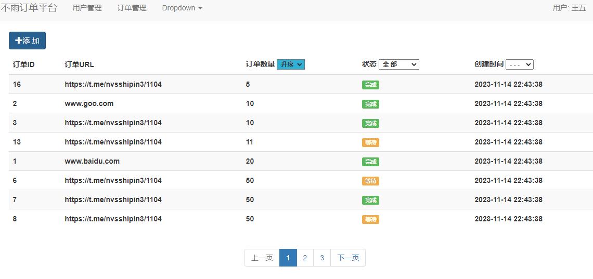

# web_template
# by @董不雨

须知:
1.需要修改
..\shangpin\sql\mysql.py 
文件夹里的数据
#即--->mysql的登录和数据库的一些数据

用户登录界面:

订单预览界面:

新建订单界面:

配置文件:
config.ini --->根据自己的sql/redis/session密码去配置,已完成自动连接;

文件打包:
pypinstaller已经完成了区分python环境 / 文件包环境 

外置:
上传文件到服务端(设置格式/大小)

预留:
task--->正儿八经完成任务的.py文件留出来了

